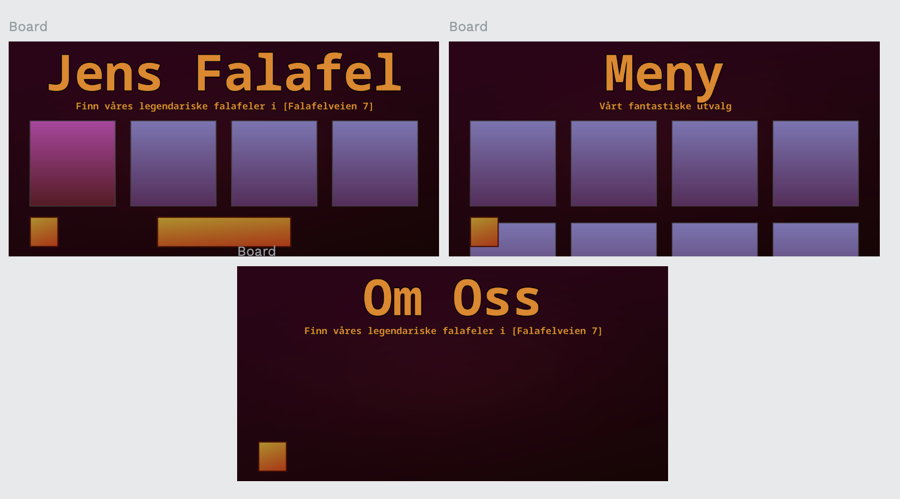
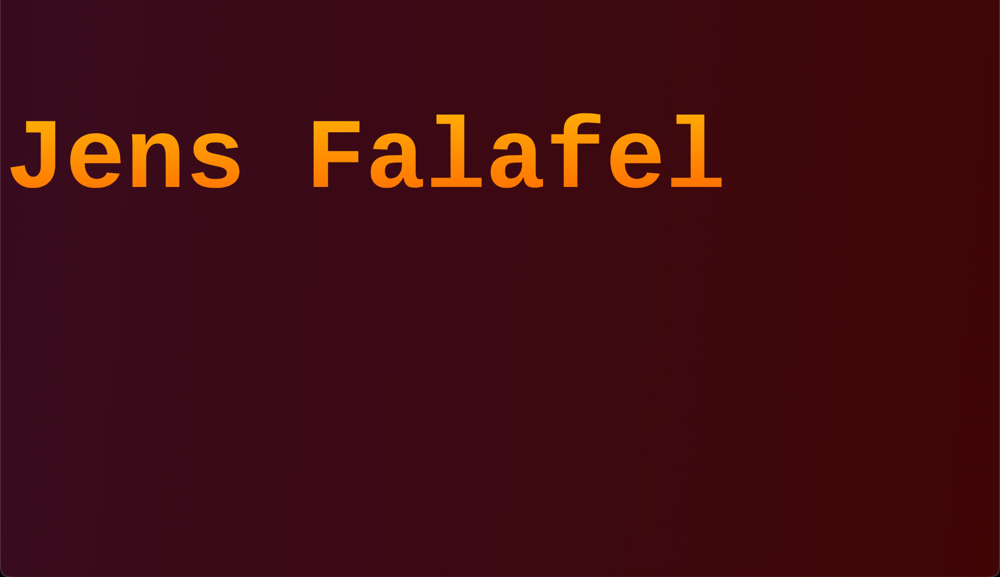
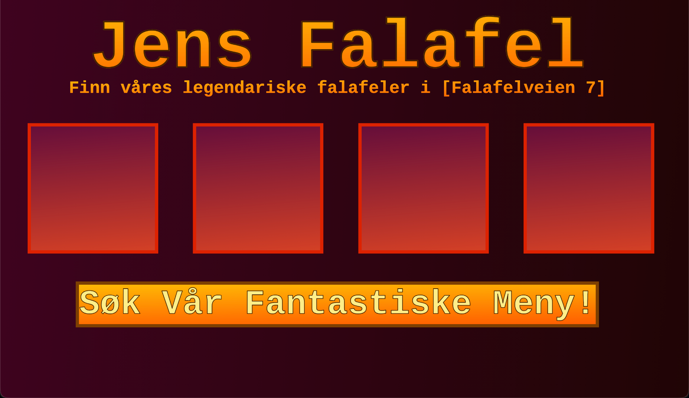

Andre dag vi jobber med **Jens Falafel**

Forrige gang lagde jeg et konsept i *PenPot*. Jeg startet også så vidt på nettsiden selv, men har siden tapt det arbeidet.

Vi var bedt om å sette opp en GitHub repo, som jeg gjorde på en litt ukonvensjonell måte.
Istedetfor `init` brukte jeg `clone` på det tomme GitHub repositoriet, som automatisk setter opp en kobling.
La dermed til `index.html`, `style.css`, `main.js`, og `UNLICENSE`.

Etter litt søking på *hvordan skape gradienter i CSS* fant jeg to nettsider, en for bakgrunn og en annen for tekst.
https://cssgradient.io/
https://web-toolbox.dev/en/tools/gradient-text-generator
Jeg brukte disse for å skape basen på front-pagen.

Dermed brukte jeg resten av timen på å lage ut resten av front-page designet. Jeg brukte divs for rutene og <a> for "Se Vår Fantastiske Meny". Resten var styling i CSS

