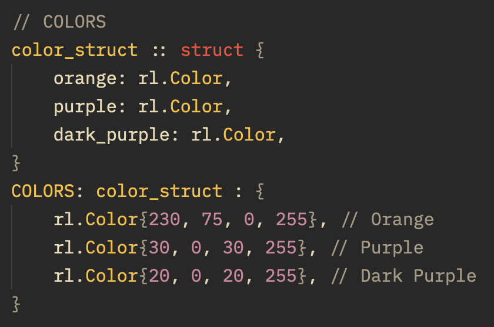
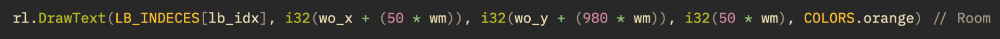
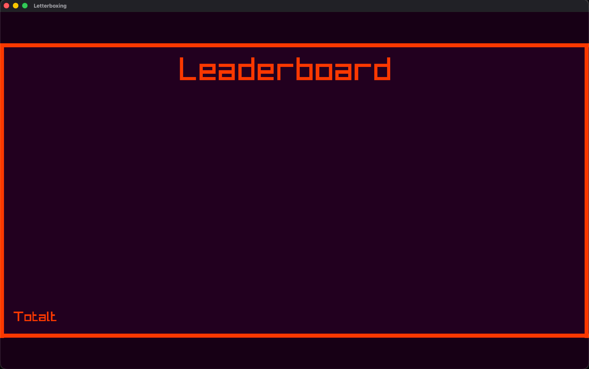

### (02) Fredag 9. Oktober 2026
Fortsettelse på leaderboard. Har et letterboxing-vindu åpent via forrige gang. Ligger bak siden jeg ikke fikk jobbe på prosjektet ettersom jeg har vært slapp.

Etter litt diskusjon med Per, Lauritz, og Magnus har jeg valgt å holde det så enkelt så mulig, der jeg kun måler tid.
Jeg startet med å definere egne farger i en struct. Disse blir brukt i elementene som tegnes, som gjør det lettere å endre fargetema og ryddigere kode. Dette ligner mye på enums.

Dette, og litt tekst med `rl.DrawText()` ble slik:

Til slutt pushet jeg til Codeberg. Neste gang skal jeg flytte repository etter dette siden den ligger i feil mappe (Web istedetfor Odin).