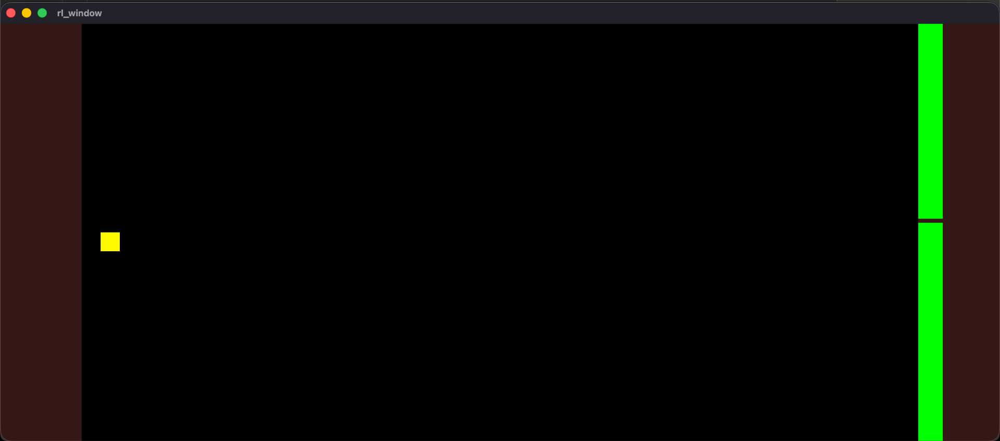
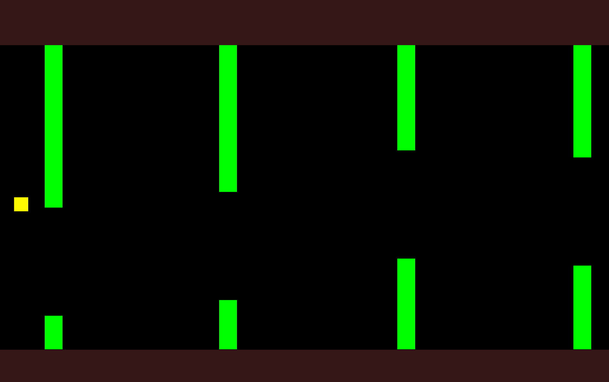

09:00-09:45

Kort time. Måtte lære om buffers i Odin ettersom jeg ønsket å printe FPS, der jeg måtte gjøre om en `i32` til en `cstring`. Jeg fikk KI til å guide meg rundt dette.

Funksjonen `strconv.write_int([]u8, i64, int)`  returnerer en string fra en i64. Et buffer ([]u8 eller []byte), er en midlertidig lagringsplass der data kan bli skrevet fra oversettelsen. Om det går riktig, returneres verdien i bufferet.

12:15-15:30

Fikk litt energi tilbake. Jobber mot å gjenskape Flappy Bird i Odin+RayLib. Startet med datastrukturen:
```
// BIRD
BIRD_X: i32 : 50
bird_y: i32 = 540

// PIPES
pipe :: struct {
	x: f32,
	gap_pos: i32,
}
pipes: [8]pipe
pipe_timer: f32 = 0
pipe_index: i32 = 8

GAP: i32 : 300
PIPE_SPEED: f32 : 500
```

Dermed startet jeg på pipe-logikken -- Ettersom logikken er ordnet kan jeg tegne rørene.
Dette var ganske enkelt gitt at jeg har gjort dette før i andre språk.
```
// PIPE LOGIC
pipe_timer += dt

for pipe_timer > 1.25 {
	if pipe_index == 8 { pipe_index = 0 }
	pipes[pipe_index] = {2160, f32(rl.GetRandomValue(100, 980 - i32(GAP)))}
	pipe_index += 1
	pipe_timer -= 1.25
}

for &p in pipes {
	if p.x > f32(-PIPE_WIDTH) {
		p.x -= PIPE_SPEED * dt
	}
}
```

Det tok litt fikling å få renderingen til å fungere, men fant ut at logikken min var inkorrekt, og rørene aldri flyttet seg on-screen.

Men etter jeg fant ut problemet (to if-setninger som aldri kunne begge være sanne pga feil retning på <), så funket det fint:


Resten var veldig basic logikk for fuglen (tyngdekraft og oppovermomentum på tastetrykk)
