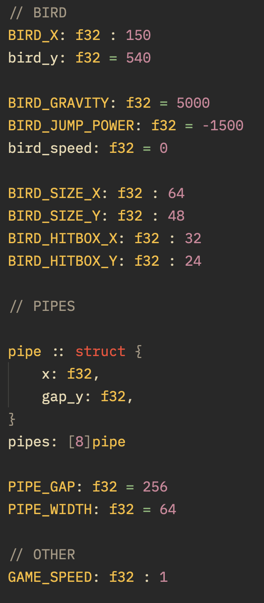

Vi har en. basic flappy-bird klone, men kun det visuelle og bevegelsen. Vi trenger spilllogikk.

Først, starter jeg med collisions. Når røret er mellom en minimum og maksimum x-akse, er den i rekkevidde av fuglen. Da passer vi på at fuglen er innenfor mellomrommet. Om den ikke er, skal vi mærke det som et treff.

Siden jeg ønsker at collisions skal fungere som forventet selv om vi endrer variabler (som mellomrom, bredde, eller hitbox på fuglen) må vi definere alle relevante variabler, og regne uten inline-konstanter.
Koden begynner å bli fiklete og matcher ikke dette målet, så jeg skriver det om, med referanse på den gamle koden.
Her er et bilde av de nye variablene. Mærk hvor mange konstante variabler det er. De er slik sånn at jeg kan endre variaben, og all logikken matcher (både for fuglen og for berøring)

